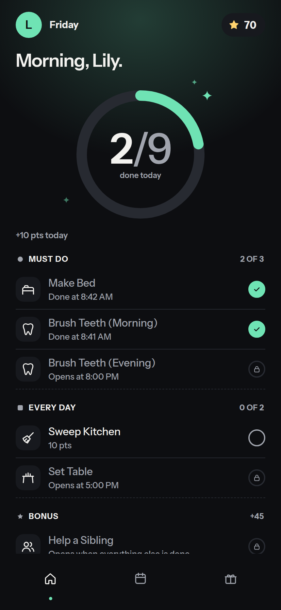
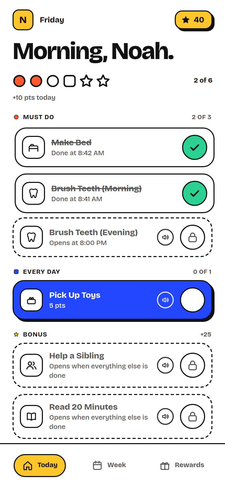
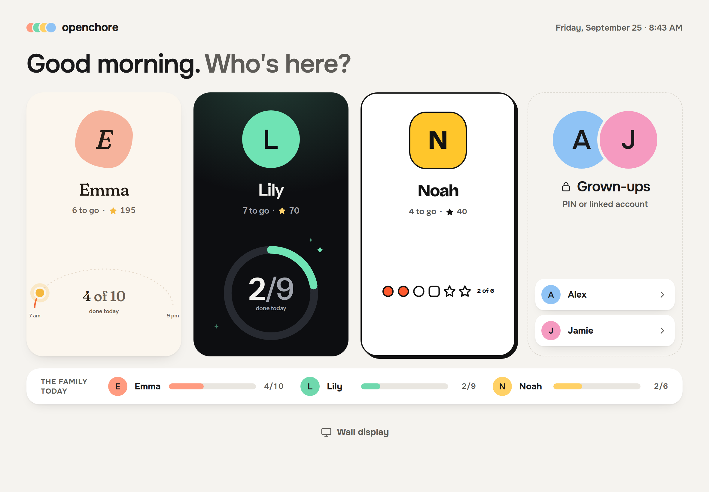
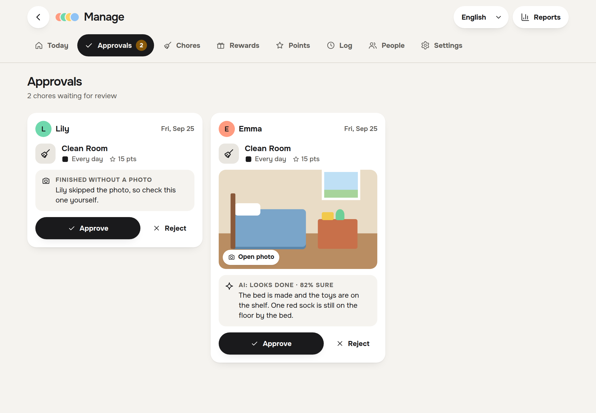
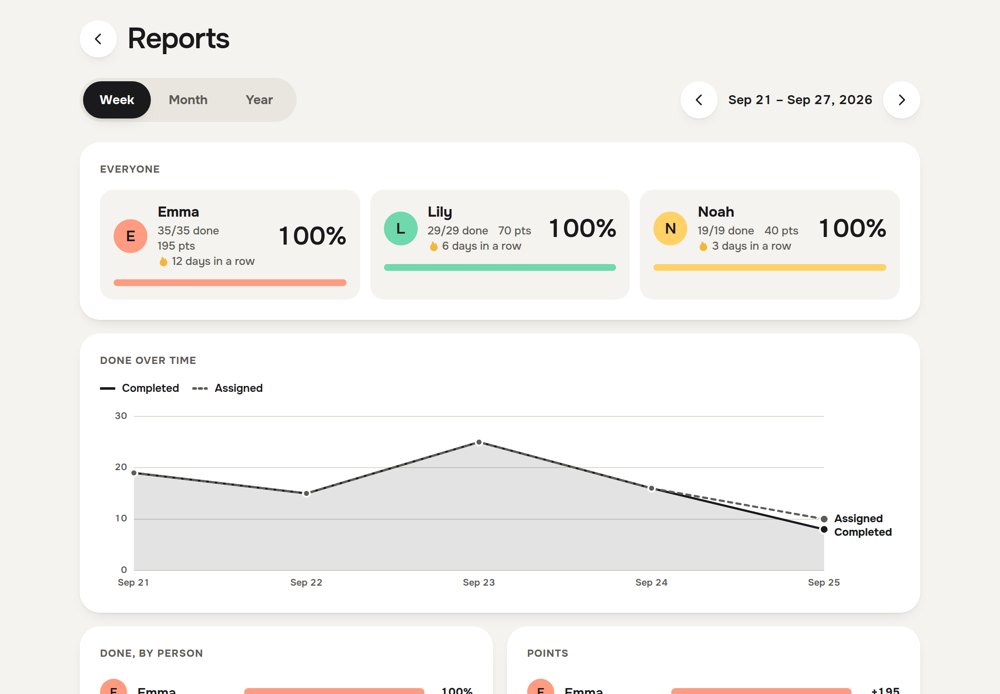

<div align="center">

# OpenChore

**Household chores, turned into a game your kids actually check.**

A self-hosted family chore tracker with a points economy, a rewards store,
streaks, and an always-on wall display. One Go binary, one SQLite file, no cloud
account.

[](https://github.com/liftedkilt/openchore/releases)
[](https://github.com/liftedkilt/openchore/actions/workflows/build.yml)
[](LICENSE)
[](https://go.dev)
[](https://react.dev)
[](https://web.dev/progressive-web-apps/)


</div>

---

## Why OpenChore

Chore charts fall apart because nobody looks at them. OpenChore is built for a
tablet mounted where the family already stands — the kitchen wall — so the chart
looks back.

- **Every kid gets their own app.** Each person picks a skin — warm
  **Sunroom**, bold **Blocks** or dark **Tint** — and a colour that follows
  them everywhere. Shared screens stay neutral so nobody's look wins.
- **It runs on your hardware.** A single static binary and a SQLite file. No
  subscription, no account, no telemetry.
- **Points are a real economy.** Every credit and debit lands in a transaction
  ledger. Kids spend on rewards you define, at prices you set.
- **The rules do the nagging.** Deadlines, time locks, expiry penalties, and
  daily decay are enforced by the server, not by you at 9pm.
- **Built to be wired up.** Signed outbound webhooks, per-chore trigger URLs,
  API tokens, and a Home Assistant integration.
- **Optional AI, your choice of model.** A vision model can pre-check photo
  proof for you and write up each week, and chores can be read aloud in a
  recorded voice. Point it at a model on your own machine or a hosted one — or
  leave it off entirely.

## Quick start

```bash
git clone https://github.com/liftedkilt/openchore.git
cd openchore
cp config/config.example.yaml config/config.yaml   # your family, chores, rewards
docker compose up -d
```

Open **http://localhost:8080** and tap your door on the family picker.

> [!IMPORTANT]
> Parents sign in to their own profile with a PIN (the example config uses
> `1234` for Alex and `5678` for Jamie) and then tap **Manage**. Change those
> PINs before putting this on your network: tap your avatar, then
> **Change PIN**.
> Want Pocket ID, Authelia, Google or another OpenID Connect sign-in? See
> [Signing in](docs/authentication.md).

`config.yaml` is applied **only when the database is empty**. After first boot,
manage everything from the admin panel — or wipe and re-seed with
`./redeploy.sh --wipe`. Starting with no config at all drops you into a guided
setup wizard instead.

Want the AI extras? They are off by default. Point OpenChore at any
OpenAI-compatible model — a local one from the compose profiles below, Ollama,
or a hosted API — see [AI features](docs/ai.md):

```bash
# in .env: AI_BASE_URL=http://llama:8080/v1  AI_MODEL=gemma-4-e4b
#          TTS_BASE_URL=http://kokoro:8880/v1
docker compose --profile ai --profile tts up -d   # Gemma 4 E4B (~6 GB RAM) + Kokoro voices (~2 GB)
```

### Upgrading to 1.0

1.0 is the first versioned release: a redesigned app, per-person skins and
colours, sign-in on each profile, and an AI that only advises. Pull the new
images and restart; migrations run on start. Existing themes are mapped to the
new skins and everyone is given a colour. Two things need a look:

- **Sign-in.** The household passcode is gone; every parent now needs their
  own PIN or linked account. See
  [Upgrading from the household passcode](docs/authentication.md#upgrading-from-the-household-passcode).
- **AI.** The LiteRT/Ollama settings are replaced by any OpenAI-compatible
  endpoint. See
  [Upgrading from the LiteRT/Ollama setup](docs/ai.md#upgrading-from-the-litertollama-setup).

## How the points work

The scheduling model is what makes the economy hold together. Chores fall into
three tiers, and the tiers gate each other:

| Tier | Behavior |
|------|----------|
| **Required** | Non-negotiable. Nothing else pays out until these are done. |
| **Core** | The daily routine. Points are held **pending** until every required chore is complete. |
| **Bonus** | Optional extras. Only awarded once required *and* core are finished. |

That single rule stops the obvious exploit: cherry-picking the fun 15-point
bonus chore and skipping the ones that matter.

Around it sit the other levers:

- **Time locks** — a chore stays hidden until `available_at`, and groups itself
  into morning / afternoon / evening.
- **Deadlines** — past `due_by`, a schedule either **blocks** completion, awards
  **no points**, or applies a **penalty**, your choice per schedule.
- **Decay** — an optional daily debit when the previous day was left unfinished.
  Points already committed to a savings goal are not a safe harbour: if the
  spendable balance can't cover the debit, decay reclaims the rest from the
  kid's goals (personal first, then their share of a family pool).
- **Streaks** — consecutive days with everything non-bonus done, with milestone
  bonuses you configure.
- **Approval** — chores can require a parent to sign off, with photo proof, before
  points are released.

## A look around

### One app, three skins

Each kid's screen is the same app — same tabs, same chore rows, same one-tap
check — drawn in the skin they chose. Their progress hero changes with it: a
sun arc, a ring, or a row of shapes.

<table>
<tr>
<td width="33%"></td>
<td width="33%"></td>
<td width="33%"></td>
</tr>
<tr>
<td align="center"><b>Sunroom</b> — warm and soft</td>
<td align="center"><b>Tint</b> — calm, dark, lit in your colour</td>
<td align="center"><b>Blocks</b> — bold and graphic</td>
</tr>
<tr>
<td></td>
<td></td>
<td></td>
</tr>
<tr>
<td align="center"><b>Week</b> — each day's ring and the streak</td>
<td align="center"><b>Rewards</b> — spend it now or save for it</td>
<td align="center"><b>Sign in</b> — PIN or single sign-on</td>
</tr>
</table>

### The family's screens

Anything that shows more than one person uses **House**, a neutral frame (with
**House Dark** for the evening) where each person appears as a door in their own
skin.

<table>
<tr>
<td width="50%"></td>
<td width="50%"></td>
</tr>
<tr>
<td align="center"><b>Who's here?</b> — tap your door to start</td>
<td align="center"><b>Approvals</b> — photo proof, with an optional AI second look</td>
</tr>
<tr>
<td></td>
<td></td>
</tr>
<tr>
<td align="center"><b>Manage</b> — everyone's day; tap a circle to tick a chore off for them</td>
<td align="center"><b>Reports</b> — scorecards, trends and what gets missed</td>
</tr>
</table>

## Features

<table>
<tr><td valign="top" width="33%">

**Scheduling**
- Weekly, every-N-days, or one-off
- Time locks and deadlines
- Multi-child assignment
- Family and first-come chores
- Quick-assign for ad-hoc tasks
- Vacation mode

</td><td valign="top" width="33%">

**Economy**
- Transaction ledger
- Rewards store with stock limits
- Per-kid pricing and visibility
- Savings commitments and pools
- Streak milestones
- Configurable decay and penalties

</td><td valign="top" width="33%">

**Household**
- Parent approval queue
- Parents can take part too
- PINs and OIDC single sign-on
- Photo proof via QR handoff
- Discord notifications
- Reports: scorecards, trends, misses
- Three skins, eight person colours
- House and House Dark for shared screens
- English and German

</td></tr>
<tr><td valign="top">

**Integrations**
- Outbound webhooks, HMAC-signed
- Delivery log with responses
- Per-chore trigger URLs
- Bearer API tokens
- Home Assistant integration

</td><td valign="top">

**Optional AI** (local or hosted)
- Photo notes for approvals (never rejects)
- Weekly summaries
- Chore description drafting
- Recorded read-aloud voices

</td><td valign="top">

**Accessibility**
- Read-aloud chore cards
- Swipe-to-complete
- 44px minimum tap targets
- Installable PWA, fullscreen
- Ambient wall display mode
- Category shapes, not just colours

</td></tr>
</table>

## Configuration

| Variable | Default | Purpose |
|----------|---------|---------|
| `PORT` | `8080` | API listen port |
| `DB_PATH` | `openchore.db` | SQLite file location |
| `CONFIG_PATH` | `config/config.yaml` | Seed configuration |
| `TZ` | system | **Set this** — deadlines and time locks depend on it |
| `WEB_PORT` | `8080` | Host port for the web container |
| `AI_BASE_URL`, `AI_MODEL`, `AI_API_KEY` | — | OpenAI-compatible model for AI features. Can also be set under Manage → Settings; the variable wins. See [AI features](docs/ai.md) |
| `TTS_BASE_URL`, `TTS_MODEL`, `TTS_API_KEY` | — | OpenAI-compatible speech service for read-aloud audio (or set it under Manage → Settings); the browser's voice is used when neither is set |
| `POINTS_DECAY_INTERVAL` | `15m` | How often the decay worker checks (the e2e suite shortens it) |
| `OPENCHORE_PUBLIC_URL` | request host | External URL used for OIDC redirect URIs |
| `OIDC_ISSUER`, `OIDC_CLIENT_ID`, `OIDC_CLIENT_SECRET`, … | — | One OIDC provider without editing config (providers can also be added under Manage → Settings); see [Signing in](docs/authentication.md) |
| `OPENCHORE_SESSION_SECRET` | generated | Session signing key (≥32 chars); otherwise generated once and stored in the database |

## Development

Requires Go 1.25+ and Node 22+.

```bash
make install    # Go modules + npm packages
make dev        # wipes the DB, seeds from config, runs API :8080 + Vite :5173
make test       # Go integration tests against a real SQLite DB
make test-e2e   # Playwright suite, fresh database
make build      # static binary + production bundle
```

`make dev` **deletes the database** on every run — that's how re-seeding works.
Point `DB_PATH` elsewhere if you care about the data.

The stack is Go with `chi` and pure-Go SQLite (`CGO_ENABLED=0`, WAL, single
writer), React 18 + TypeScript + Vite on the front, and `golang-migrate` with
embedded SQL for schema changes. Tests are integration-first: a real database
and `httptest`, no mocks.

## Documentation

- [Signing in](docs/authentication.md) — PINs, parents, sessions, OIDC providers, upgrading
- [AI features](docs/ai.md) — photo review, summaries, read-aloud voices, choosing a model, upgrading
- [API reference](docs/api.md) — endpoints, auth, and webhook events
- [Roadmap](ROADMAP.md) — shipped and planned
- [CLAUDE.md](CLAUDE.md) — architecture notes and conventions

## License

[MIT](LICENSE)
